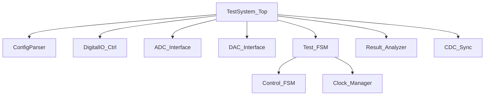

# FPGA 测试系统文档

## 系统架构图



## 模块文档索引

- [TestSystem_Top](/docs/modules/TestSystem_Top.md) - 系统顶层模块
- [ADC_Interface](/docs/modules/ADC_Interface.md) - ADC 数据采集接口
- [DAC_Interface](/docs/modules/DAC_Interface.md) - DAC 控制接口
- [CDC_Sync](/docs/modules/CDC_Sync.md) - 跨时钟域信号同步模块
- [Clock_Manager](/docs/modules/Clock_Manager.md) - 多时钟域管理模块

# FPGA 测试系统文档

## 系统架构图


## 模块文档索引

- [TestSystem_Top](/docs/modules/TestSystem_Top.md) - 系统顶层模块
- [ADC_Interface](/docs/modules/ADC_Interface.md) - ADC 数据采集接口
- [DAC_Interface](/docs/modules/DAC_Interface.md) - DAC 控制接口
- [CDC_Sync](/docs/modules/CDC_Sync.md) - 跨时钟域信号同步模块
- [Clock_Manager](/docs/modules/Clock_Manager.md) - 多时钟域管理模块

# FPGA 测试系统文档

## 系统架构图


## 模块文档索引

- [TestSystem_Top](/docs/modules/TestSystem_Top.md) - 系统顶层模块
- [ADC_Interface](/docs/modules/ADC_Interface.md) - ADC 数据采集接口
- [DAC_Interface](/docs/modules/DAC_Interface.md) - DAC 控制接口
- [CDC_Sync](/docs/modules/CDC_Sync.md) - 跨时钟域信号同步模块
- [Clock_Manager](/docs/modules/Clock_Manager.md) - 多时钟域管理模块

# FPGA 测试系统文档

## 系统架构图


## 模块文档索引

- [TestSystem_Top](/docs/modules/TestSystem_Top.md) - 系统顶层模块
- [ADC_Interface](/docs/modules/ADC_Interface.md) - ADC 数据采集接口
- [DAC_Interface](/docs/modules/DAC_Interface.md) - DAC 控制接口
- [CDC_Sync](/docs/modules/CDC_Sync.md) - 跨时钟域信号同步模块
- [Clock_Manager](/docs/modules/Clock_Manager.md) - 时钟管理模块
- [Control_FSM](/docs/modules/Control_FSM.md) - 控制状态机模块
- [ConfigParser](/docs/modules/ConfigParser.md) - PC 指令解析与参数配置模块

# FPGA 测试系统文档

## 系统架构图


## 模块文档索引

- [TestSystem_Top](/docs/modules/TestSystem_Top.md) - 系统顶层模块
- [ADC_Interface](/docs/modules/ADC_Interface.md) - ADC 数据采集接口
- [DAC_Interface](/docs/modules/DAC_Interface.md) - DAC 控制接口
- [CDC_Sync](/docs/modules/CDC_Sync.md) - 跨时钟域信号同步模块
- [Clock_Manager](/docs/modules/Clock_Manager.md) - 多时钟域管理模块

# FPGA 测试系统文档

## 系统架构图


## 模块文档索引

- [TestSystem_Top](/docs/modules/TestSystem_Top.md) - 系统顶层模块
- [ADC_Interface](/docs/modules/ADC_Interface.md) - ADC 数据采集接口
- [DAC_Interface](/docs/modules/DAC_Interface.md) - DAC 控制接口
- [CDC_Sync](/docs/modules/CDC_Sync.md) - 跨时钟域信号同步模块
- [Clock_Manager](/docs/modules/Clock_Manager.md) - 多时钟域管理模块

# FPGA 测试系统文档

## 系统架构图


## 模块文档索引

- [TestSystem_Top](/docs/modules/TestSystem_Top.md) - 系统顶层模块
- [ADC_Interface](/docs/modules/ADC_Interface.md) - ADC 数据采集接口
- [DAC_Interface](/docs/modules/DAC_Interface.md) - DAC 控制接口
- [CDC_Sync](/docs/modules/CDC_Sync.md) - 跨时钟域信号同步模块
- [Clock_Manager](/docs/modules/Clock_Manager.md) - 多时钟域管理模块

# FPGA 测试系统文档

## 系统架构图


## 模块文档索引

- [TestSystem_Top](/docs/modules/TestSystem_Top.md) - 系统顶层模块
- [ADC_Interface](/docs/modules/ADC_Interface.md) - ADC 数据采集接口
- [DAC_Interface](/docs/modules/DAC_Interface.md) - DAC 控制接口
- [CDC_Sync](/docs/modules/CDC_Sync.md) - 跨时钟域信号同步模块
- [Clock_Manager](/docs/modules/Clock_Manager.md) - 时钟管理模块
- [Control_FSM](/docs/modules/Control_FSM.md) - 控制状态机模块
- [ConfigParser](/docs/modules/ConfigParser.md) - PC 指令解析模块
- [DigitalIO_Ctrl](/docs/modules/DigitalIO_Ctrl.md) - 32 位数字 IO 控制模块

# FPGA 测试系统文档

## 系统架构图


## 模块文档索引

- [TestSystem_Top](/docs/modules/TestSystem_Top.md) - 系统顶层模块
- [ADC_Interface](/docs/modules/ADC_Interface.md) - ADC 数据采集接口
- [DAC_Interface](/docs/modules/DAC_Interface.md) - DAC 控制接口
- [CDC_Sync](/docs/modules/CDC_Sync.md) - 跨时钟域信号同步模块
- [Clock_Manager](/docs/modules/Clock_Manager.md) - 多时钟域管理模块

# FPGA 测试系统文档

## 系统架构图


## 模块文档索引

- [TestSystem_Top](/docs/modules/TestSystem_Top.md) - 系统顶层模块
- [ADC_Interface](/docs/modules/ADC_Interface.md) - ADC 数据采集接口
- [DAC_Interface](/docs/modules/DAC_Interface.md) - DAC 控制接口
- [CDC_Sync](/docs/modules/CDC_Sync.md) - 跨时钟域信号同步模块
- [Clock_Manager](/docs/modules/Clock_Manager.md) - 多时钟域管理模块

# FPGA 测试系统文档

## 系统架构图


## 模块文档索引

- [TestSystem_Top](/docs/modules/TestSystem_Top.md) - 系统顶层模块
- [ADC_Interface](/docs/modules/ADC_Interface.md) - ADC 数据采集接口
- [DAC_Interface](/docs/modules/DAC_Interface.md) - DAC 控制接口
- [CDC_Sync](/docs/modules/CDC_Sync.md) - 跨时钟域信号同步模块
- [Clock_Manager](/docs/modules/Clock_Manager.md) - 多时钟域管理模块

# FPGA 测试系统文档

## 系统架构图


## 模块文档索引

- [TestSystem_Top](/docs/modules/TestSystem_Top.md) - 系统顶层模块
- [ADC_Interface](/docs/modules/ADC_Interface.md) - ADC 数据采集接口
- [DAC_Interface](/docs/modules/DAC_Interface.md) - DAC 控制接口
- [CDC_Sync](/docs/modules/CDC_Sync.md) - 跨时钟域信号同步模块
- [Clock_Manager](/docs/modules/Clock_Manager.md) - 时钟管理模块
- [Control_FSM](/docs/modules/Control_FSM.md) - 控制状态机模块
- [ConfigParser](/docs/modules/ConfigParser.md) - PC 指令解析与参数配置模块

# FPGA 测试系统文档

## 系统架构图


## 模块文档索引

- [TestSystem_Top](/docs/modules/TestSystem_Top.md) - 系统顶层模块
- [ADC_Interface](/docs/modules/ADC_Interface.md) - ADC 数据采集接口
- [DAC_Interface](/docs/modules/DAC_Interface.md) - DAC 控制接口
- [CDC_Sync](/docs/modules/CDC_Sync.md) - 跨时钟域信号同步模块
- [Clock_Manager](/docs/modules/Clock_Manager.md) - 多时钟域管理模块

# FPGA 测试系统文档

## 系统架构图


## 模块文档索引

- [TestSystem_Top](/docs/modules/TestSystem_Top.md) - 系统顶层模块
- [ADC_Interface](/docs/modules/ADC_Interface.md) - ADC 数据采集接口
- [DAC_Interface](/docs/modules/DAC_Interface.md) - DAC 控制接口
- [CDC_Sync](/docs/modules/CDC_Sync.md) - 跨时钟域信号同步模块
- [Clock_Manager](/docs/modules/Clock_Manager.md) - 多时钟域管理模块

# FPGA 测试系统文档

## 系统架构图


## 模块文档索引

- [TestSystem_Top](/docs/modules/TestSystem_Top.md) - 系统顶层模块
- [ADC_Interface](/docs/modules/ADC_Interface.md) - ADC 数据采集接口
- [DAC_Interface](/docs/modules/DAC_Interface.md) - DAC 控制接口
- [CDC_Sync](/docs/modules/CDC_Sync.md) - 跨时钟域信号同步模块
- [Clock_Manager](/docs/modules/Clock_Manager.md) - 多时钟域管理模块

# FPGA 测试系统文档

## 系统架构图


## 模块文档索引

- [TestSystem_Top](/docs/modules/TestSystem_Top.md) - 系统顶层模块
- [ADC_Interface](/docs/modules/ADC_Interface.md) - ADC 数据采集接口
- [DAC_Interface](/docs/modules/DAC_Interface.md) - DAC 控制接口
- [CDC_Sync](/docs/modules/CDC_Sync.md) - 跨时钟域信号同步模块
- [Clock_Manager](/docs/modules/Clock_Manager.md) - 时钟管理模块
- [Control_FSM](/docs/modules/Control_FSM.md) - 控制状态机模块
- [ConfigParser](/docs/modules/ConfigParser.md) - PC 指令解析模块
- [DigitalIO_Ctrl](/docs/modules/DigitalIO_Ctrl.md) - 数字 IO 控制模块

## 系统特性

1. 支持多协议通信（SPI/I2C/UART）
2. 实时数据采集与分析
3. 可配置测试模式
4. 自动化波形记录功能
5. 跨时钟域同步机制

## 快速开始

```bash
# 查看系统文档
open docs/README.md

# 运行仿真测试
make sim
```
