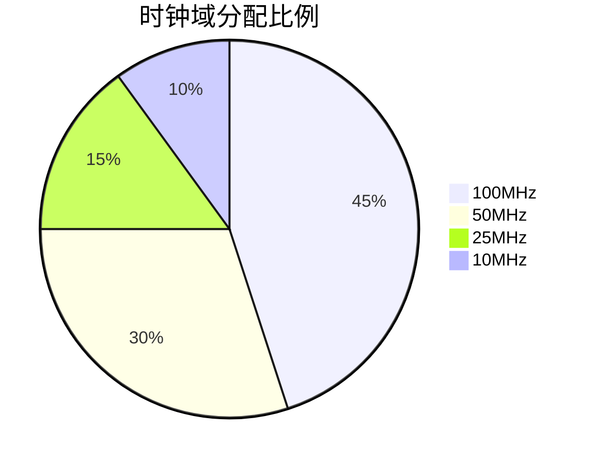

# Clock_Manager 模块说明书

## 功能概述

- 系统时钟管理模块
- 支持多时钟域生成
- 提供时钟使能信号

## 时钟架构



## 端口定义

| 信号名称    | 方向   | 位宽 | 描述             |
| ----------- | ------ | ---- | ---------------- |
| clk_in      | input  | 1    | 输入时钟(125MHz) |
| rst_n       | input  | 1    | 异步复位(低有效) |
| clk_100m    | output | 1    | 100MHz 时钟输出  |
| clk_50m     | output | 1    | 50MHz 时钟输出   |
| clk_25m     | output | 1    | 25MHz 时钟输出   |
| clk_10m     | output | 1    | 10MHz 时钟输出   |
| clk_en_100m | output | 1    | 100MHz 时钟使能  |

## 分频参数

| 参数名称       | 值  | 说明            |
| -------------- | --- | --------------- |
| DIV_100M_RATIO | 1   | 100MHz 分频系数 |
| DIV_50M_RATIO  | 2   | 50MHz 分频系数  |
| DIV_25M_RATIO  | 5   | 25MHz 分频系数  |
| DIV_10M_RATIO  | 12  | 10MHz 分频系数  |

## 时钟约束

```tcl
create_clock -name clk_100m -period 10 [get_ports clk_100m]
create_clock -name clk_50m -period 20 [get_ports clk_50m]
derive_pll_clocks
```

## 使用注意事项

1. 上电后需要至少 10 个时钟周期完成时钟稳定
2. 切换时钟频率前需先复位模块
3. 各时钟域间通信必须使用 CDC_Sync 模块
