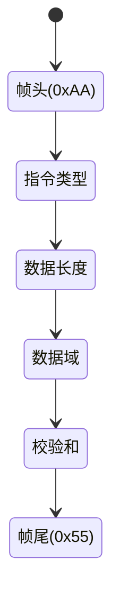

# ConfigParser 模块说明书

## 功能概述

- PC 指令解析模块
- 支持 ASCII 和二进制格式指令
- 提供配置参数校验功能

## 指令格式



## 端口定义

| 信号名称      | 方向   | 位宽 | 描述             |
| ------------- | ------ | ---- | ---------------- |
| clk           | input  | 1    | 系统时钟         |
| rst_n         | input  | 1    | 异步复位(低有效) |
| uart_rx_data  | input  | 8    | UART 接收数据    |
| uart_rx_valid | input  | 1    | 数据有效标志     |
| param_addr    | output | 4    | 参数存储地址     |
| param_value   | output | 16   | 参数数值         |
| param_valid   | output | 1    | 参数有效标志     |

## 指令类型表

| 指令码 | 说明             | 数据长度 |
| ------ | ---------------- | -------- |
| 0x01   | ADC 采样率设置   | 2        |
| 0x02   | DAC 输出电压设置 | 2        |
| 0x03   | 测试模式选择     | 1        |
| 0x04   | IO 方向配置      | 1        |

## 校验算法

```verilog
always @(posedge clk) begin
    if(rst_n) begin
        checksum <= 8'h00;
        for(i=0; i<DATA_LEN; i=i+1)
            checksum <= checksum + data[i];
    end
end
```

## 异常处理

1. 帧头错误：连续 3 次错误触发中断
2. 校验失败：丢弃当前数据帧
3. 超时机制：500 个时钟周期未完成解析自动复位
