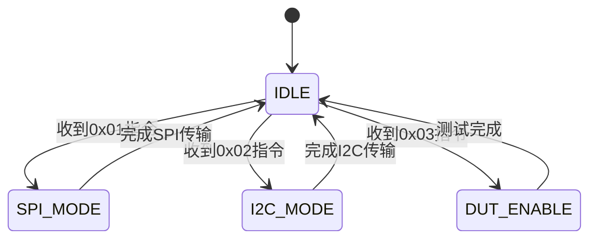

# Control_FSM 模块说明书

## 功能概述

- 主控制状态机模块
- 解析 PC 指令并分发控制信号
- 协调 SPI/I2C/DUT 工作模式

## 状态转移图

## 端口定义

| 信号名称    | 方向   | 位宽 | 描述             |
| ----------- | ------ | ---- | ---------------- |
| clk         | input  | 1    | 系统时钟(100MHz) |
| rst_n       | input  | 1    | 异步复位(低有效) |
| frame_valid | input  | 1    | 帧有效信号       |
| cmd_type    | input  | 8    | PC 指令类型      |
| spi_start   | output | 1    | SPI 传输启动信号 |
| i2c_start   | output | 1    | I2C 传输启动信号 |
| dut_en      | output | 1    | DUT 使能信号     |

## 指令类型定义

| 指令码 | 功能说明          |
| ------ | ----------------- |
| 0x01   | 启动 SPI 通信     |
| 0x02   | 启动 I2C 通信     |
| 0x03   | 使能 DUT 测试模式 |

## 状态机参数

| 参数名称       | 值    | 说明                 |
| -------------- | ----- | -------------------- |
| T_SPI_TIMEOUT  | 100us | SPI 最大等待时间     |
| T_I2C_TIMEOUT  | 200us | I2C 最大等待时间     |
| T_DUT_EN_DELAY | 50ns  | DUT 使能信号建立时间 |

## 异常处理机制

1. 超时自动复位机制
2. 指令校验失败重传
3. 状态机死锁检测
