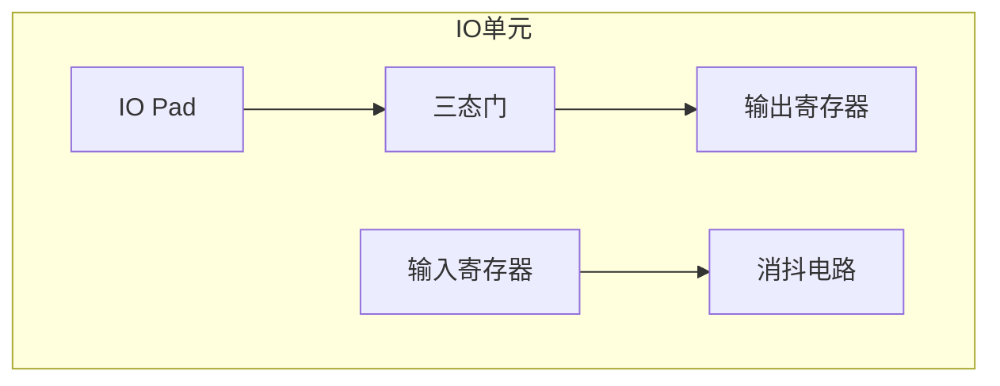

# DigitalIO_Ctrl 模块说明书

## 功能概述

- 数字 IO 控制模块
- 支持 32 位双向 IO 配置
- 提供输入消抖功能

## IO 结构示意图



## 端口定义

| 信号名称 | 方向   | 位宽 | 描述             |
| -------- | ------ | ---- | ---------------- |
| clk      | input  | 1    | 系统时钟         |
| rst_n    | input  | 1    | 异步复位(低有效) |
| io_dir   | input  | 32   | IO 方向控制字    |
| data_out | input  | 32   | 输出数据         |
| data_in  | output | 32   | 输入数据         |
| io_pads  | inout  | 32   | 物理 IO 引脚     |

## 关键参数

| 参数名称        | 默认值 | 说明             |
| --------------- | ------ | ---------------- |
| DEBOUNCE_CYCLES | 20     | 消抖时钟周期数   |
| OUTPUT_DELAY    | 2      | 输出路径延迟级数 |

## 时序要求

```tcl
set_input_delay -clock clk -max 2.5 [get_ports io_pads]
set_output_delay -clock clk -max 3.0 [get_ports io_pads]
set_max_transition 1.5 [get_ports io_pads]
```

## 工作模式

| 模式 | io_dir 值 | 描述             |
| ---- | --------- | ---------------- |
| 输入 | 0         | 高阻态输入模式   |
| 输出 | 1         | 推挽输出模式     |
| 总线 | 动态切换  | 双向总线通信模式 |
